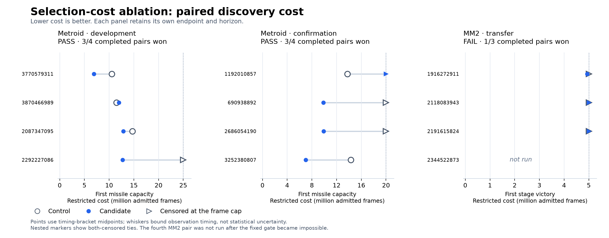

# Selection cost priors: completed evidence and remaining gap

Removing the selector's historical cost ranks improved first-missile discovery
in two separately registered Metroid panels. Development and independent
confirmation each passed their fixed allocation gate. The unchanged candidate
failed the bounded Mega Man 2 transfer gate. No Metroid boss or Wily 4
breakthrough is established; the research goal remains unachieved.

## What changed and what the theory establishes

The explicit experimental policy removes historical coarsest-progress-group
time ranks from parent selection. It preserves retention, action generation,
the semantic walk, novelty and barren counters, and the existing exhaustion
rules. Defaults remain unchanged. The old policy exactly reproduces the full
25,000,911-frame calibration stream on the new binary; both game configurations
passed full report/checkpoint replay qualification.

The [mechanism analysis](selection-hypothesis.md) establishes a useful structural
result: ordinary Metroid retention geometry offers at most four active entries
per selection cell, all within the old within-cell equal-weight band. Thus the
within-cell ablation cannot change this registered Metroid configuration's law.
The operative intervention is between cells. It changes both historical cost
preference and interactions with tied ranks and the combined novelty cap; these
panels do not separate those effects.

Conditional distribution differences prove the intervention is active, not that
it helps. For a fixed archive and bounded continuation outcome, expected gain is
the covariance between the probability reweighting and continuation utility;
its sign is not implied by a large distribution change. The native paired panels
test that unresolved empirical question without changing the retention policy.

## What the experiments establish

| Panel | Endpoint and horizon | Registered gate | Candidate/control mean restricted cost |
| --- | --- | --- | --- |
| [S01 development](s01-analysis.json) | First missile capacity, 25M frames | Pass: 3/4 strict wins | 0.71988–0.72107 |
| [R01 independent confirmation](r01-analysis.json) | First missile capacity, 20M frames | Pass: 3/4 strict wins | 0.68684–0.68764 |
| [T01 transfer](t01-analysis.json) | First MM2 stage victory, 5M frames | Fail: 1 win and 2 ties; fourth pair unrun | Unmeasured for the four-pair panel |

Metroid's reductions are about 28% and 31%, respectively. These ranges bound
checkpoint timing, not population uncertainty. All nonattainments retain their
full restricted cost, and censored cells materially affect the result. Four
pairs per Metroid panel are small samples; neither panel is a power guarantee
or a general efficacy estimate. The two horizons are not pooled. Total CPU and
elapsed ratios passed their registered tolerance in both panels, with at most
1.24% higher elapsed cost. All exported discovery witnesses replayed twice.

T01 stopped as registered when three strict wins became mathematically
impossible. Its one victory came only 60,993 frames below the 5M cap. The other
two pairs were censored in both arms. No result is imputed to the unrun pair,
and no longer-horizon transfer conclusion follows.

The [secondary audit](secondary-milestones.json) records one development
candidate energy tank, none in confirmation, and no Bombs, boss-area entry or
boss defeat in either Metroid panel. Earlier failed retention gates remain
failed. Current untouched validation was not run.

## Cost and next decision

The [ledger](work-ledger-after-t01.json) records **489,962,470 admitted search
frames** and **28,815,743 known auxiliary frame charges**. The search total
includes 22,526 frames of bounded cap drain. Setup, unadmitted work and physical
reconstruction are additional where unmeasured. Approximately 10M search frames
remain under this tranche's 500M ceiling, insufficient for another calibrated
Metroid panel or deeper qualification. No search budget was borrowed from the
auxiliary allowance.

The next scientific question is whether the unchanged Metroid candidate's early
gain survives to a later milestone. A renewed allocation should first qualify a
useful later endpoint and horizon under ordinary control, then freeze fresh
paired development and independent confirmation before boss validation. Zero
Bombs observations here make another 20–25M Bombs panel a poor use of compute;
historical longer runs are exploratory context, not compatible fresh controls.
MM2 needs its own positive transfer evidence before any Wily-depth claim.
[Issue #279](https://github.com/pH14/harmony/issues/279) retains those depth gaps.

Before another expensive milestone panel,
[issue #290](https://github.com/pH14/harmony/issues/290) proposes a replay-safe
stop after complete endpoint evidence. D01/S01 admitted 121,030,688 frames after
the first positive endpoint checkpoint. That is measured opportunity, not
implemented savings. The change needs deterministic boundary/replay checks and
a prospectively appropriate resource comparison; it must not alter these
completed panels retroactively. No further experiment or budget extension is
registered by this summary.

The [README](README.md) links all registrations, raw results, qualification
failures, consultations and audits. [GOAL.md](GOAL.md) preserves the stronger
breakthrough criterion and the fixed tranche limit.
