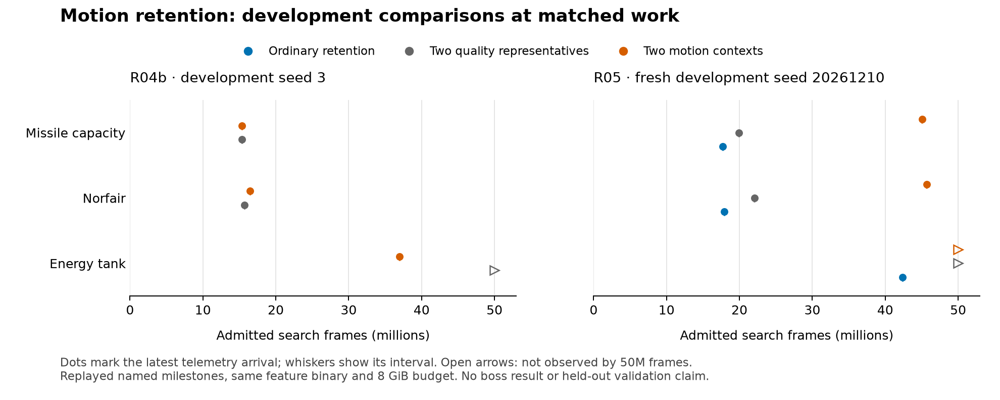

# Archive retention science: current synthesis

The work has established an executable method for evaluating archive designs
and rejected several expensive directions. It has **not established a fresh
Metroid boss or MM2 Wily 4 breakthrough**. Motion retention's initial gain failed
fresh replication against both ordinary-retention and capacity controls. All
tested families have now failed their escalation gates; no longer search
campaign is queued. [Draft PR #287](https://github.com/pH14/harmony/pull/287)
preserves the implementation and evidence for review.

## What is now rigorous

The [formal model](theory.md) separates three claims: an archive obeys its
retention rule, the retained states preserve distinguishing futures, and the
complete adaptive search discovers useful outcomes sooner. Each needs different
evidence. Exact fixed-stream invariants do not imply adaptive-search dominance.
Finite counterexamples exercise the real archive, while replayed competitor
probes test whether the workload abstraction actually merges different futures.

This separation caught concrete errors. Zero parent-selection credit does not
prove a state was never continued. Snapshot residency includes historical
anchors and does not define active retention. With two survivors, a candidate
differing from one survivor need not add anything to their union. Averaging
future events across actions can also merge states that require opposite
actions. Each claim now has an executable counterexample or a checked actual
campaign reconstruction. [The literature update](literature-update.md) connects
these obligations to predictive representations and later Go-Explore work.

The [verified-stream exposure audit](exposure-trace-analysis.json) finds that
65–74% of newly retained states never subsequently referenced as a parent were
already continued inside their birth job, across five short qualification
streams. This is a lower bound from visible decision ordering, not a measure of
adequate exploration or a deep-search population estimate. It rules out using
“never selected” as synonymous with “never explored.”

## What the experiments decided

| Candidate | Controlled result | Allocation decision |
|---|---|---|
| Joint resource-threshold coverage | Its initial MM2 win matched the simpler two-extreme control; three shared-prefix Heat cases gave one win, one tie, one loss. | Stop this family. |
| Finer Metroid position/pose key | Same named milestones; tank about 16% earlier, below the 20% gate, with nearly four times as many active states. | Stop this family. |
| Quality plus job-ranked sample, Metroid | No added milestone or qualifying speedup; misses the control's tank at 50M frames. | Stop this family on Metroid. |
| Quality plus job-ranked sample, MM2 | Favorable earlier depth result failed its prospective replication: ordinary retention cleared four stages; sampling failed Heat at the full 85M ceiling. | Stop longer sampling chains. |
| Two distinct motion contexts, Metroid | Initial tank gain reverses on a fresh seed: ordinary gets missiles at17.7M and a tank at42.4M; context gets missiles at45.0M and no tank at50M. Capacity control also reaches missiles sooner. | Failed both comparisons; stop longer motion campaigns. |

The [R05 analysis](r05-analysis.json) records all three complete50M-frame arms,
with no wall censoring and no qualifying20% speedup. The context mechanism is
active and obeys its rule:31,248 active entries,14,085 distinct-context pairs,
zero same-context pairs. The performance failure therefore persists despite
correct implementation of the proposed retention invariant.

A separately registered replay diagnostic on the new seed's ordinary-control
competitors used2.50M physical frames in143 seconds. Useful suffix differences
appeared in6/8 pairs with matching motion contexts and6/8 with different contexts.
The partition did not concentrate the useful differences in this small panel.
No capability gain was observed. [P05](p05-analysis.json) preserves the fixed
sample, both objective directions and its limited descriptive scope; it does
not reopen the failed search gate.

The new [complete-survivor audit](u01-analysis.json) resolves a second measurement
ambiguity. Four rejected candidates expose17 map-and-suffix events absent from
both retained incumbents; one survives six suffixes where both incumbents die.
Three other apparent pairwise differences are already covered by the second
survivor. The one sampled actual replacement gains two map events and loses
none; rejected opportunities are a different category. These are seven fixed
competitions ×16 suffixes,431,144 physical frames in23 seconds, with no capability
gain. Four exact ARM stream checks and unchanged default audit bytes qualify
the reporting change. The callback measures local-rule proposals before global
eviction, not the final global archive or an improved search policy.

The [ledger](README.md) contains all favorable and adverse results, source and
asset identities, work limits, actual costs and censoring. The positive
shared-prefix Heat diagnostic is conditional on a selected origin; it does not
override the negative fresh-chain replication. No held-out validation seed has
been used, and no production default changed.

## What can be carried forward

P03 reconstructed sixteen same-slot competitor pairs and tested 64 identical
suffixes from each side. Fourteen pairs differed on useful local exits or
survival. P04's frozen coarse motion descriptor separated six of eight useful
pairs that the finer spatial key still merged, including one pair with identical
recorded mechanical state. Another pair shares all inspected motion bytes but
still differs. This is a candidate descriptor with a demonstrated limit.

The optional motion feature and two-representative policies are implemented,
versioned and tested. Qualification reproduced five exact search streams,
checked cached motion against direct RAM and original snapshot hashes, and
verified that the active archive obeys the intended context rule. The initial
development result adds a tank at matched work, but its fresh replication fails.
Sampled process-tree RSS in the initial pair was about2.35GiB for context retention versus1.62GiB
for quality retention under the common8GiB archive budget; the newly reached
capability also opens additional cells. Splice and resume
behavior with the metadata remain outside this qualification. On the fresh seed,
context uses less memory while making less progress; lower RSS alone is also an
insufficient success metric.

[Portable checks](portable-verification.json) cover runner failures, chain
limits, dependency ownership, generic replay, NES feature combinations, strict
Clippy and formatting. The experiment executables remain frozen while evidence
and theory tests are added to the isolated branch.

Existing follow-ups cover [boss observations](https://github.com/pH14/harmony/issues/281),
[actual continuation exposure](https://github.com/pH14/harmony/issues/283),
[full-key donor ordering](https://github.com/pH14/harmony/issues/270), and
[behavioral retention](https://github.com/pH14/harmony/issues/286). The next
predictive-retention design should measure action-conditioned differences
against the complete survivor set and charge probe work explicitly. None of
the current proxy metrics authorizes an unbounded search run.

[A quantitative decision contract](predictive-retention-contract.md) now spells
out gained versus lost event coverage and finite-sample assumptions. On the
same existing P03 suffixes, map-event counts favor discarded states while final
survival favors survivors. That objective reversal is another reason to freeze
task utility before selecting a heuristic. It changes no running policy or gate.

The [probe-cost scenario](u01-probe-cost-scenario.json) also constrains the next
design. Even removing duplicate replay and prefix reconstruction, these selected
three-state probes consume about37k suffix frames per competition. Under an
explicit naive-cost assumption, keeping probes at5% of admitted search plus
probe frames would allow roughly one per14k competitions in the short quality
cell. This is an illustrative scenario, not a population estimate or complete
physical baseline. It argues for testing sparse probes or reusing already
executed continuations before proposing blanket behavioral probing.
